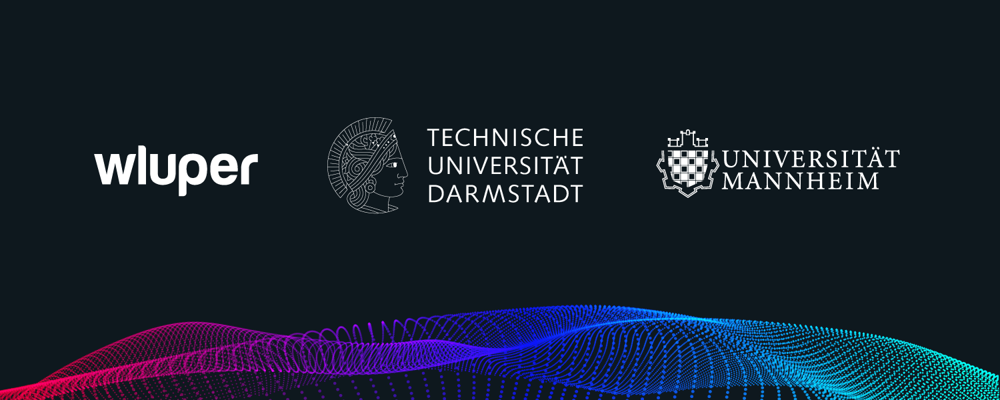

# Readme for Retrograph


## Description
Retrograph is the official repo behind University of Mannheim's, TU Darmstadt's and Wluper's Commonsense Adapter Paper.

The key idea is that one can inject knowledge into pretrained language models using Adapters.

We try two methods to generate training data for the adapters:
1. OMCS
2. Random walk from ConceptNet

We evaluate on:
1. glue
2. csqa
3. copa
4. siqa

Key results, you can find in the paper:
[Link to Paper]


## A - Getting it running:

Environment: python 3.6

Please, follow these instructions to execute the experiments.

### 0 - Download BERT (This needs to be done for all experiments)
Step 0: Download BERT
```
bash ./0_download_bert.sh
```
It creates:
1. models/BERT_BASE_UNCASED


### Next Steps:
1. Generate Random Walks and Pretrain Adapter -> Go to [B - Random Walks and Pretraining](#random_walk)

2. Finetune on existing Adapters -> Go to [C - Finetuning on Pretrained Adapters](#finetuning):
- [GLUE](#glue)
- [CSQA](#csqa)
- [COPA](#copa)
- [SIQA](#siqa)


## B - Random Walks and Pretraining
Follow these steps for pretraining adapter.
<a name="random_walk"></a>

### 1 - Download Relations
Step 1: Download Relations
```
bash ./1_download_relations.sh
```
It creates:
1. relations/cn_relationType*.txt


### 2 - Creating Random Walks

Step 2: Create the sequences of tokens using random walks generated by node2vec:
```
bash ./2_create_random_walks.sh
```

It creates the main file `randomwalks/random_walk_1.0_1.0_2_15.p` and others also (`randomwalks/cn_assertions_filtered.tsv`)


### 3 - Generating the Corpus (This takes a serious while)
Step 3: Create natural language text from the random walks:
```
bash ./3_generate_corpus.sh
```
The generated corpus will be used as input for BERT + Adapters. It creates a file in TF format: `randomwalks/rw_corpus_1.0_1.0_2_15_nl.tf` (and also generates: `randomwalks/rw_corpus_1.0_1.0_2_15_nl.tf`)


### 4 - Pretraining Adapter

Step 4: Pretrain the adapter using the RW corpus:
```
bash ./4_pretrain_adapter.sh
```
Creates a model in: `models/output_pretrain_adapter`


## C - Finetuning on Pretrained Adapters
<a name="finetuning"></a>

### 9 - Download Pretrained Adapters (needs to be done if you don't have already pretrained adapters)

```
9_downlaod_pretrained_adapters_rw30.sh
9_downlaod_pretrained_adapters_omcs.sh
```

**ALL models will be saved in Creates a model in: `models/output_model_finetunning`**
**Modify the task_2_....sh files if you want to change hyper parameters**


## GLUE
<a name="glue"></a>
**Run all glue_1,2_.sh files in that order**


## CommonsenseQA
<a name="csqa"></a>
**Run all csqa_1,2_.sh files in that order**

## COPA
<a name="copa"></a>
**Run all copa_1,2_.sh files in that order**

## SIQA
<a name="siqa"></a>
**Run all siqa_1,2_.sh files in that order**


<!-- EOF -->
